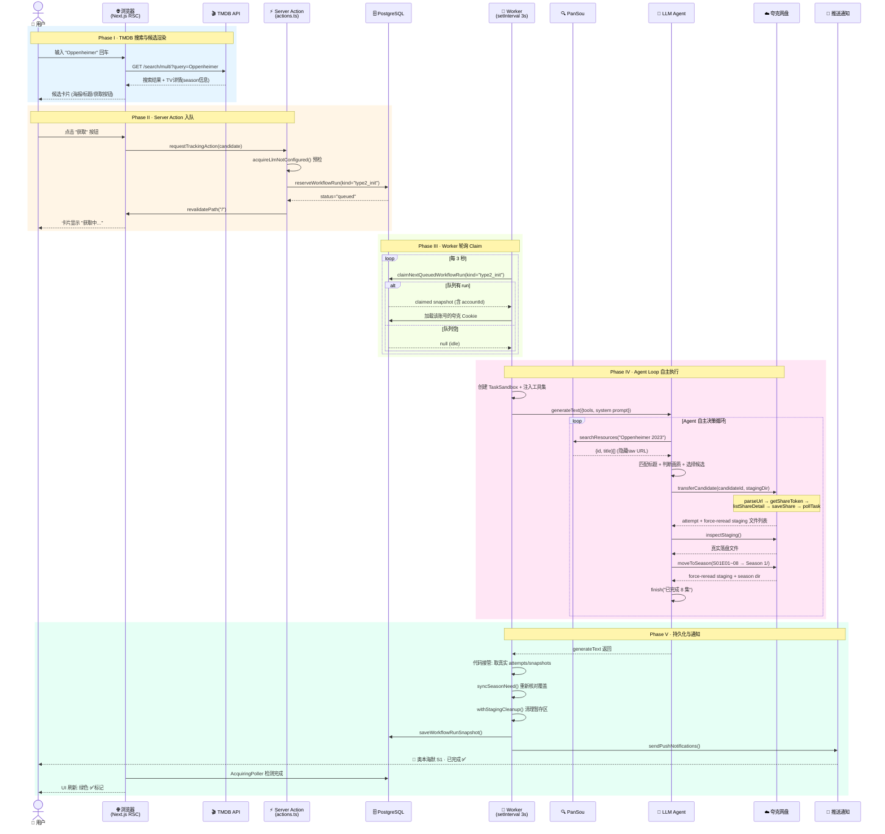
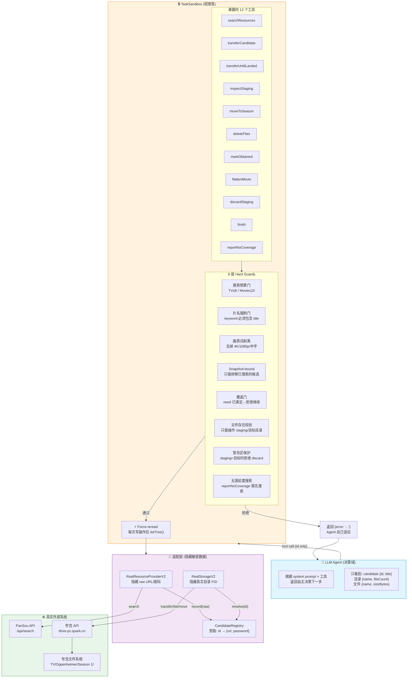
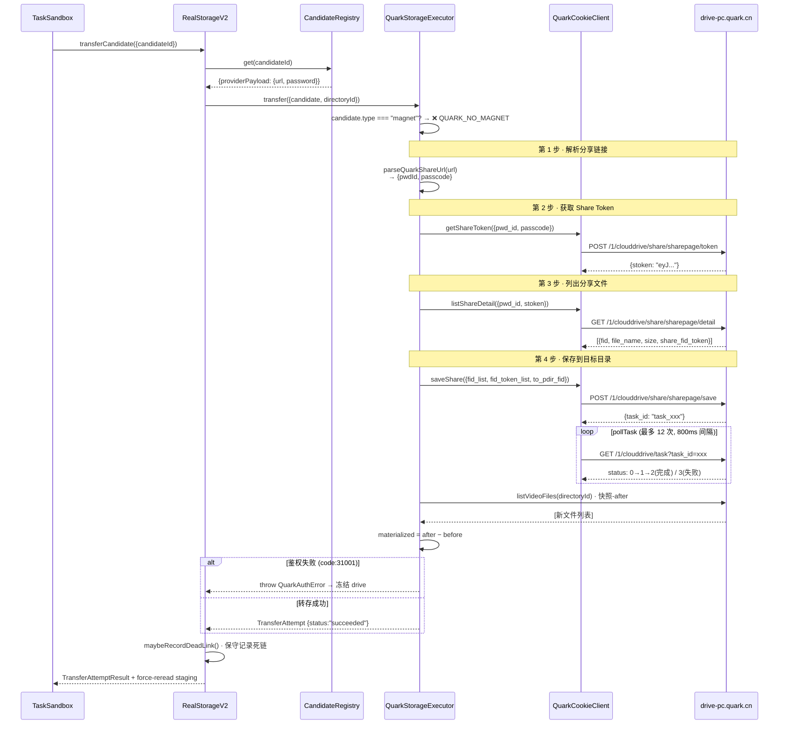
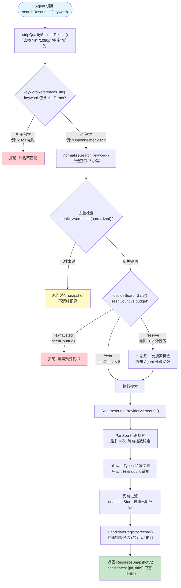
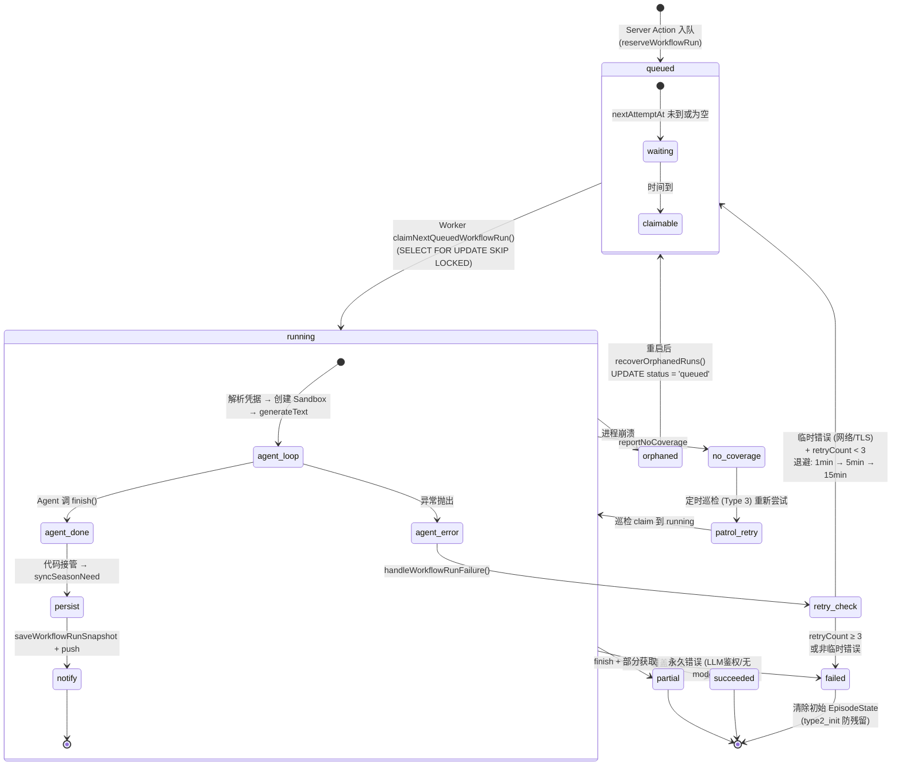
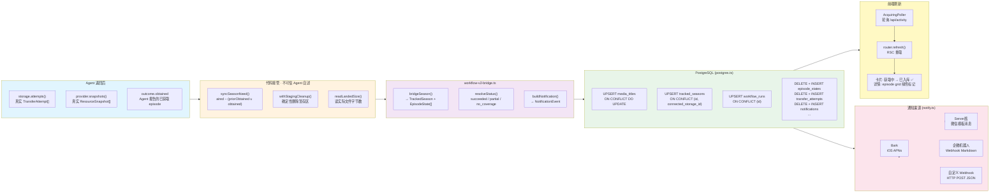
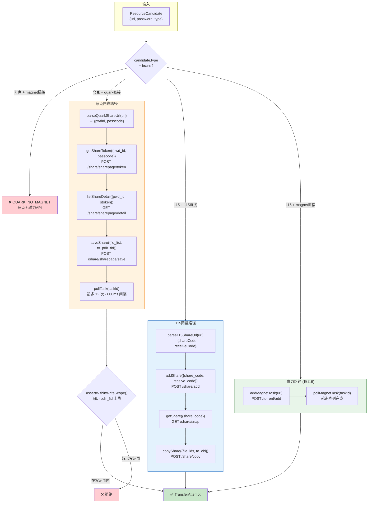

# Mediary Scout 架构深度分析

> 生成日期：2026-06-30
> 基于代码库当前 `main` 分支

## 一、项目定位

**Mediary Scout** 是一个 **自部署的智能媒体资源获取系统**。用户搜索电影/电视剧/动漫，LLM Agent 自动从资源索引站 (PanSou/Prowlarr) 搜索最佳匹配，秒传到你的 115/夸克/光鸭网盘，然后校验落盘结果并持续追踪缺失剧集。

它解决的核心问题：**"搜索 + 转存 + 校验 + 追踪"这一整套媒体获取流程的自动化**，由 Agent 从证据驱动，而非对规则硬编码。

---

## 二、技术栈

| 维度 | 选型 |
|---|---|
| **语言** | TypeScript (strict mode, `noUncheckedIndexedAccess`) |
| **运行时** | Node.js ≥22.13 |
| **Web 框架** | Next.js 16 (App Router, React 19, RSC) |
| **Agent 引擎** | Vercel AI SDK (`ai` v6), `@ai-sdk/openai-compatible` |
| **数据库** | PostgreSQL 16 (托管于 Docker Compose) |
| **队列/状态** | PG 表模拟 (无 Redis/外部队列) |
| **ORM** | 无 — 原始 `pg` 连接 + SQL |
| **测试** | Vitest v4 + Playwright |
| **部署** | Docker Compose (web + PG + PanSou 三容器) |
| **网络穿透** | 可选 Cloudflare Tunnel |
| **代理** | CF Worker 提供内置 TMDB 代理 (开箱即用) |
| **包管理** | npm workspaces (monorepo) |

---

## 三、项目结构 (Monorepo)

```
mediary-scout/
├── apps/web/              # Next.js Web 应用 + 进程内 Worker
│   ├── app/               # 页面路由 (App Router)
│   │   ├── page.tsx        # 首页 (搜索 + 媒体库双 Tab)
│   │   ├── show/[tmdbId]/  # 剧集/电影详情页
│   │   ├── activity/       # 实时活动页
│   │   ├── settings/       # 设置页
│   │   ├── notifications/  # 通知页
│   │   ├── login/          # 登录页
│   │   └── api/            # API 路由 (auth/115/quark/activity)
│   ├── components/         # React 组件 (44个)
│   ├── lib/                # 业务胶水层 (background-worker, runtime, demo)
│   └── public/             # 静态资源
├── packages/workflow/      # 核心业务逻辑 (纯 TS，无 UI 依赖)
│   ├── src/
│   │   ├── acquisition-v2/ # 🔥 Agent 驱动获取引擎 (V2, 核心模块)
│   │   ├── domain.ts        # 领域模型 (核心类型)
│   │   ├── ports.ts         # 资源接口 (Provider / Storage)
│   │   ├── repository.ts    # 持久化仓库接口 + InMemory实现
│   │   ├── worker.ts        # 队列 Worker (type2/3/series/movie)
│   │   ├── runner-v2.ts     # V2 运行器 (持久化包装)
│   │   ├── notify.ts        # 多渠道推送 (Bark/Server酱/企微/Webhook)
│   │   ├── postgres.ts      # PG 数据库适配器
│   │   ├── storage-brands.ts# 网盘品牌注册表
│   │   ├── pan115-*.ts      # 115网盘客户端/登录/存储
│   │   ├── quark-*.ts       # 夸克网盘客户端/登录/存储
│   │   ├── guangya-*.ts     # 光鸭网盘客户端/存储
│   │   ├── pansou-provider.ts # PanSou 资源搜索
│   │   ├── prowlarr-provider.ts # Prowlarr 磁力聚合
│   │   └── tmdb-provider.ts   # TMDB 元数据
│   └── tests/
├── workers/tmdb-proxy/     # CF Worker TMDB 代理
├── scripts/                # 运维脚本/调研探针 (30+个)
├── tests/                  # Python E2E 测试
├── docs/                   # 文档
├── references/             # SKILL 引用手册 (Agent 技能文档)
├── docker-compose.yml      # 自部署编排
└── Dockerfile              # 单容器构建
```

---

## 四、核心架构

### 4.1 整体数据流

```
浏览器 "获取" 点击 → Server Action enqueue → PG 队列(run_status=queued)
                                                    ↓
          后台 Worker (轮询 claim) → runner-v2 → V2 Workflow
                                                    ↓
          ┌───────────────── Agent Loop ──────────────────┐
          │ Sandbox (权限笼) → AI SDK generateText        │
          │   ├ searchResources (搜索资源)                │
          │   ├ transferCandidate (秒传到网盘)            │
          │   ├ inspectStaging (核对落盘)                 │
          │   ├ moveToSeason (按季分发)                   │
          │   ├ deleteFiles (去重保留大文件)              │
          │   ├ markObtained (标记已获取)                 │
          │   └ finish/reportNoCoverage (完成/无源)       │
          └──────────────────────────────────────────────┘
                    ↓
          PG 记录结果 → 通知推送 → UI 刷新
```

### 4.2 核心设计原则

1. **Sandbox (权限笼)**: Agent 只能操作 scoped 的暂存区和目标季目录，由 `TaskSandbox` 强制执行 hard guards
2. **Force-reread**: 每个写操作后系统强制重新读取网盘真实状态返回给 Agent，Agent 必须基于证据判断
3. **Dead Link 黑名单**: 失败的链接被记录，agent 看到 `{error}` 文本后必须自行理解和适应（不像传统代码 catch → abort）
4. **Resumable State**: 全部状态存 PG，Worker 重启后从 DB 恢复，Agent 从网盘 + DB 真实状态重建，无缓存 chat history
5. **Monotonic Progress**: 进度条只能前进不能后退，每个 phase 有权重区间

### 4.3 Agent 架构 (V2, 核心创新)

**从弱节点链到强语义 Agent 的彻底重构**:

- **旧设计 (V1)**: 链式弱节点 (AgentNode)，每个节点只看局部视图，类似流水线 filter → 层层累积误差
- **新设计 (V2)**: 一个强语义 Agent 通过 sandbox 工具自行决策。它完整看到任务证据（season coverage need + search results + staging contents + target dirs），自己驱动 observe-act-verify 循环

Agent 有两类:
- **TV/Anime Agent**: 处理季覆盖、多季打包分发、字幕识别、去重
- **Movie Agent**: 处理正片身份识别(防翻拍)、多候选 秒传-until-landed

### 4.4 网盘品牌注册表

| Brand | Provider | 转存方式 | 资源类型 |
|---|---|---|---|
| 115网盘 | `pan115` | 秒传分享链 + 磁力离线 | 115链接 + 磁力 |
| 夸克网盘 | `quark` | 转存分享链 (无磁力API) | 夸克分享链 |
| 光鸭云盘 | `guangya` | 磁力/离线 (无秒传/分享) | 磁力/ed2k/BT |

**Tree Model**: 一个账号可以挂多个网盘，每个网盘独立的 (account_id, connected_storage_id) 隔离追踪、获取、库。

### 4.5 系统三大 Workflow (Type 1/2/3)

| Type | 触发方式 | 场景 |
|---|---|---|
| **Type 1** (series) | 用户点 "获取所有季" | 一次获取一部剧的所有季 |
| **Type 2** (init) | 用户点单季 "获取" | 初始化追踪一季，首次获取 |
| **Type 3** (monitor) | 定时自动巡检 | 检查追更中剧集的新播出 + 缺失集补全 |
| **Movie** | 用户点 "获取" 电影 | 单次电影获取 |
| **Reserved** | 预定未上映电影 | 上映日期到达后自动触发 |

---

## 五、Sandbox：Agent 的权限笼

### 5.1 一句话定义

**Sandbox 是 Agent 唯一能接触的"世界"**——Agent 看不到真实的网盘目录 ID、资源直链 URL、或 API 凭据，只能通过 Sandbox 暴露的有限工具来观察和操作，每个工具的返回结果都是系统**强制重新读取**的真实状态，而非 Agent 自己预测的结果。

### 5.2 架构分层

```
┌─────────────────────────────────────────────┐
│                 Agent (LLM)                 │  ← 只看到 V2 接口(id/title)
│  searchResources / transferCandidate / ...  │
├─────────────────────────────────────────────┤
│             TaskSandbox                      │  ← 权限笼:预算/去重/范围/覆盖门
│  (sandbox.ts)                               │
├────────────────────┬────────────────────────┤
│  RealResourceProviderV2 │  RealStorageV2     │  ← 适配层:隐藏 raw url/dir id
│  (real-provider-adapter)│ (real-storage-adapter)│
├────────────────────┼────────────────────────┤
│  ResourceProvider  │  StorageExecutor       │  ← 端口接口 (ports.ts)
│  (PanSou/Prowlarr) │  (115/夸克/光鸭 API)    │
├────────────────────┴────────────────────────┤
│           CandidateRegistry                  │  ← 旁路: Agent 只知道 candidate id,
│  (candidate-registry.ts)                    │     真实 url 存在这里,系统解析
└─────────────────────────────────────────────┘
```

### 5.3 Agent 看不到什么

Agent 看到的搜索结果只包含 `id` 和 `title`：

```typescript
// real-provider-adapter.ts
candidates: kept.map((candidate) => ({
  id: candidate.id,       // 一个透明句柄
  title: candidate.title,  // 人类可读标题
})),
```

真实的 `providerPayload`（包含分享链接 URL、磁力链接等）存在 `CandidateRegistry` 旁路中。Agent 调用 `transferCandidate({candidateId: "abc"})` 时，系统从 Registry 取出真实的 URL 去执行转存。

### 5.4 八层 Hard Guards

| Guard | 描述 | 代码位置 |
|---|---|---|
| **搜索预算** | TV 最多8次，Movie 8+2弹性 | `sandbox.ts:136-138` |
| **片名强制** | 关键词必须包含片名 | `sandbox.ts:193-196` |
| **画质词剥离** | 自动移除 4K/1080p/中字等 | `sandbox.ts:17-18` |
| **Snapshot-bound** | 只能用本次搜索过的 snapshot 转移 | `sandbox.ts:314-316` |
| **覆盖门** | 覆盖满足后拒绝继续转移 | `sandbox.ts:309-313` |
| **文件存在校验** | 只有暂存区/目标目录的文件可操作 | `sandbox.ts:448-453` |
| **暂存区保护** | 当暂存区=目标目录时拒绝 discard | `sandbox.ts:526-529` |
| **无源前置搜索** | reportNoCoverage 必须先有真实搜索 | `sandbox.ts:597-600` |

### 5.5 Force-reread 机制

每个写操作后，Sandbox **强制重新读取网盘真实状态**并返回给 Agent：

```typescript
// 以 transferCandidate 为例
async transferCandidate(input) {
  const attempt = await this.storage.transferCandidate({...});  // 执行转存
  const staging = await this.storage.listTree({...});           // ← 强制重读
  return { attempt, staging, ... };                              // 返回真实落盘
}
```

同理 `moveToSeason`、`deleteFiles`、`flattenMovie` 都在执行后 force-reread。

### 5.6 TransferUntilLanded — 电影死链滚动

电影场景特有的工具，Agent 排好优先级列表后一次调用：

```typescript
async transferUntilLanded({candidateIds: ["best", "second", "third"]}) {
  for (const candidateId of candidateIds) {
    const attempt = await this.storage.transferCandidate({candidateId, ...});
    if (attempt.status === "succeeded") break;        // 秒传成功 → 停止
    if (isSystemicBlockMessage(attempt.providerMessage)) break;  // 配额/鉴权 → 停止
    // 普通死链(过期/取消) → 继续下一个
  }
  return { landed: await listTree(), transferredCandidateId, attempts };
}
```

---

## 六、Agent 如何被限制在 Sandbox 内

### 6.1 调用链

```
Worker (worker.ts)
  → Runner (runner-v2.ts)
    → Workflow (workflow-v2.ts)
      → Orchestrator (orchestrator.ts)
        → TaskAgent (task-agents.ts)
          → Agent Loop (agent-loop.ts)
            → generateText(tools=Sandbox工具集)
              → LLM
```

每一步都在**缩小权限范围**——Worker 有完整的 Repository/Storage/Provider，越往下传的东西越少。

### 6.2 Orchestrator 的关键组装

```typescript
// orchestrator.ts
export async function runAcquisitionV2(request) {
  const registry = new CandidateRegistry();
  const provider = new RealResourceProviderV2({
    provider: request.provider,  // 真实 PanSou，但包了一层
    registry,
  });
  const storage = new RealStorageV2({
    executor: request.executor,  // 真实 115 API，但包了一层
    registry,
  });

  const sandbox = new TaskSandbox({
    provider,                              // V2 视图的搜索
    storage,                               // V2 视图的存储
    stagingDirectoryId: "stg_xxx",         // Agent 只能写到暂存区
    targetSeasonDirectoryIds: { 1: "s1_xxx" },
    need: ["S01E07", "S02E13"],
    titleTerms: ["奥本海默", "Oppenheimer"],
    searchBudget: 8,
  });

  const result = await runTvAnimeTaskAgent({
    sandbox,     // ← Agent 只能通过这个对象与世界交互
    model,       // ← LLM 模型
    target,      // ← 任务描述
  });
}
```

### 6.3 agent-loop.ts 暴露工具

每条工具都直接映射到 Sandbox 方法，无例外：

```typescript
export function buildSandboxToolSet(sandbox: TaskSandbox, options) {
  const tools = {
    searchResources: {
      inputSchema: z.object({ keyword: z.string() }),
      execute: (args) => asEvidence(() => sandbox.searchResources(args.keyword)),
    },
    transferCandidate: {
      inputSchema: z.object({ snapshotId: z.string(), candidateId: z.string() }),
      execute: (args) => asEvidence(() => sandbox.transferCandidate(args)),
    },
    inspectStaging: {
      inputSchema: z.object({}),
      execute: () => asEvidence(() => sandbox.inspectStaging()),
    },
    moveToSeason: {
      inputSchema: z.object({ moves: z.array(...) }),
      execute: (args) => asEvidence(() => sandbox.moveToSeason(args)),
    },
    // ... 还有 markObtained, deleteFiles, flattenMovie, discardStaging, finish, reportNoCoverage
  };
  return tools;
}
```

`asEvidence()` 把 Guard 拒绝转为 `{error: "..."}` 文本返回给 LLM，让 Agent 自己适应而不是崩溃：

```typescript
async function asEvidence(run) {
  try { return await run(); }
  catch (error) { return { error: error instanceof Error ? error.message : String(error) }; }
}
```

### 6.4 一次 transferCandidate 的完整调用序列

```
LLM: 我要调 transferCandidate({snapshotId:"X", candidateId:"abc"})
  → SDK: sandbox.transferCandidate({snapshotId:"X", candidateId:"abc"})
    → Sandbox Guard 1: this.observedSnapshots.has("X") ✓
    → Sandbox Guard 2: this.isCoverageMet() → false, 继续
    → Sandbox Guard 3: snapshot.candidates 中有 "abc" ✓
    → Adapter: storage.transferCandidate({candidateId:"abc", intoDir:"stg_xxx"})
      → Registry: registry.get("abc") → {providerPayload: {url: "https://115.com/s/xxxx"}}
        → 真实 115 API 秒传 → 成功
    → ⚡ Force-reread: storage.listTree({directoryId:"stg_xxx"}) → [奥本海默.mkv, 奥本海默.ass]
  ← SDK: {attempt: {status:"succeeded"}, staging: [...]} 
→ LLM: 看到落盘了2个文件
```

### 6.5 约束的总和

| 层级 | 约束 | 代码位置 |
|---|---|---|
| **接口降维** | Provider 只返回 `{id, title}` | `real-provider-adapter.ts:66-73` |
| **接口降维** | 真实 dir/file ID 被映射 | `real-storage-adapter.ts:116-125` |
| **旁路隔离** | raw URL 在 Registry，Agent 不可达 | `candidate-registry.ts` |
| **方法集合** | 仅 12 个工具方法 | `agent-loop.ts:87-198` |
| **参数校验** | Zod schema 限制输入 | `agent-loop.ts:96-189` |
| **Hard Guards** | 8 个守卫硬拦截 | `sandbox.ts` |
| **强制重读** | 写后 listTree 返回真实状态 | `sandbox.ts:325,466,493,554` |
| **asEvidence** | Error → `{error:"..."}` 文本 | `agent-loop.ts:23-28` |

---

## 七、控制流：LLM 与代码的边界

### 7.1 核心原则

**代码负责 what cannot be wrong**（权限、范围、持久化、通知），**LLM 负责 what requires judgment**（语义匹配、质量控制、去重选择）。

### 7.2 控制权分界线

```
┌─────────────────────────────────────────────────────────┐
│                   代码的控制域                            │
│                                                         │
│  1. 准备 Sandbox (范围/预算/暂存区)                      │
│  2. 构建 system prompt (规则/领域知识)                   │
│  3. 构建 task prompt (具体任务描述)                      │
│  4. 调用 generateText ──────────────┐                   │
│                                       │                  │
│  ┌────────────────────────────────────┼───────────────┐ │
│  │          LLM 的决策域              │               │ │
│  │                                    ▼               │ │
│  │  5. 选择关键词搜索                 │               │ │
│  │  6. 从搜索结果中挑候选             │               │ │
│  │  7. 决定转移哪个                   │               │ │
│  │  8. 核实落地文件                   │               │ │
│  │  9. 规划多季分发                   │               │ │
│  │ 10. 去重大文件决策                 │               │ │
│  │ 11. 调 finish/reportNoCoverage     │               │ │
│  │                                    │               │ │
│  │ 每步间：Sandbox 强制执行 Guard     │               │ │
│  │ 每步后：SDK 检查 stopWhen          │               │ │
│  └────────────────────────────────────┼───────────────┘ │
│                                       │                  │
│  12. generateText 返回 ◄──────────────┘                 │
│  13. 从 Adapter 取 transferAttempts/snapshots           │
│  14. 代码组装 decisions（不靠 LLM 写）                  │
│  15. 核对覆盖情况(syncSeasonNeed)                       │
│  16. 读落地文件大小                                      │
│  17. 确定性清理暂存区(withStagingCleanup)                │
│  18. 持久化到 PG                                         │
│  19. 发推送通知                                          │
│                                                         │
└─────────────────────────────────────────────────────────┘
```

### 7.3 三层停止条件

```typescript
stopWhen: [
  stepCountIs(maxSteps),           // 层1: 硬步数上限
  buildRepetitionStop(),           // 层2: Agent 重复疯转检测
  buildSystemicBlockStop(),        // 层3: 账号级阻塞检测
],
```

- **步数上限**: 最后 10 步通过 `prepareStep` 注入收尾提醒，让 Agent 优雅退出而非被突然切断
- **重复检测**: Agent 在几个工具间循环时主动切断
- **系统阻塞**: 账号配额/鉴权失败时立即停止

### 7.4 generateText 返回后代码接管

```typescript
const result = await generateText({...});

// 代码步骤：
// 1. 从 Adapter 取真实 transferAttempts（不靠 LLM 描述）
const transferAttempts = storage.attempts();
// 2. 从 Adapter 取真实 snapshots
const resourceSnapshots = provider.snapshots();
// 3. 代码组装 decisions（不靠 LLM 写 JSON）
const decisions = buildAgentDecisions({...});
// 4. 核对覆盖情况
const after = syncSeasonNeed({...});
// 5. 确定性清理暂存（Agent 出 bug 也兜底）
await withStagingCleanup({...});
// 6. 持久化 + 通知
```

---

## 八、Vercel AI SDK 的角色

### 8.1 `ai` (AI SDK v6)

`generateText()` 驱动 Agent 的 tool-use 自主循环：

1. 把 system prompt + task prompt + tools 发给 LLM
2. LLM 返回想调的工具名 + 参数
3. SDK 执行工具（调用 Sandbox → 真实操作）
4. 把工具返回值喂给 LLM
5. 循环直到 LLM 调 `finish()` 或停止条件触发

### 8.2 `@ai-sdk/openai-compatible`

让用户用**任意 OpenAI-compatible 接口**的模型：

- 用户在设置页配置 `baseURL` / `apiKey` / `modelId`
- 可以是 OpenAI 官方、第三方代理、或本地部署的模型
- 所有 API 调用在用户自己服务器上完成，作者看不到用户的 Key

```
用户配置的 LLM (BYO Key)
        ↓
@ai-sdk/openai-compatible  ← 适配任意 OpenAI-compatible 端点
        ↓
ai (generateText)          ← 驱动 Agent 的 tool-use 自主循环
        ↓
Agent 自主决策:
  搜索资源 → 判断匹配 → 秒传到网盘 → 核实落盘 → 标记完成
```

---

## 九、关键设计决策

1. **进程内 Worker**: 单实例部署，worker 与 web server 同进程，`setInterval` 3s 轮询 PG 队列
2. **PG 做队列**: 直接 `SELECT ... FOR UPDATE SKIP LOCKED` 做 claim，无需 Redis
3. **Staging 暂存区**: 转存到暂存 → 核实 → 分发到季目录 → 清空暂存，避免直接污染目标库
4. **搜索预算**: TV 最多 8 次 hard cap，Movie 8+2 弹性
5. **Episode 代码系统**: `S01E01` 格式，Agent 通过文件名语义判断映射，不持久化 file→episode 映射
6. **Provider-ahead**: Agent 主动标记超过 TMDB 已播集的超前剧集
7. **Multi-user**: 按 `account_id` 隔离，每个用户绑定自己的网盘凭据
8. **Demo Mode**: 内置只读演示，Mock 数据流展示完整获取流程

---

## 十、代码规模

| 维度 | 数量 |
|---|---|
| TypeScript 源文件 | ~110 个 |
| React 组件 | 44 个 |
| 测试文件 | ~20 个 |
| Python E2E 脚本 | 5 个 |
| 运维/调查脚本 | 30+ 个 |
| API 路由 | 19 个 |
| 网盘客户端 | 3 个 (115/夸克/光鸭) |

---

## 十一、推送通知渠道

| 渠道 | 适配器 |
|---|---|
| Bark (iOS APNs) | `createBarkChannel` |
| Server酱 Turbo (微信) | `createServerChanChannel` |
| 企业微信群机器人 | `createWeComChannel` |
| 自定义 Webhook | `createWebhookChannel` |

通知分 L1 (简单文本) 和 L2 (富文本: poster + Markdown + tap-through link)。

---

## 十二、端到端交互流程：从输入到落盘

> 以下以**夸克网盘**获取《奥本海默》第一季为例，追溯一个完整用户交互周期的每一行关键代码。

### 流程全景图

```
用户输入 "Oppenheimer"
  → [I] TMDB 搜索 → 候选卡片渲染
  → 用户点击 "获取" 按钮
  → [II] Server Action 入队 → PG 插入 queued run
  → [III] Worker 轮询 claim → 解析凭据 → 注入 Sandbox
  → [IV] Agent Loop 自主执行:
       searchResources → transferCandidate → inspectStaging → moveToSeason → finish
  → [V] 持久化 + 推送通知 → UI 刷新
```

---

### 12.1 Phase I — TMDB 搜索与候选渲染

**触发**: 用户在首页搜索框输入 "Oppenheimer" 并回车。

#### 12.1.1 客户端路由跳转

`apps/web/app/page.tsx` → `<SearchForm>` 组件 (`apps/web/components/search-form.tsx:15-54`) 拦截 submit 事件，执行 `router.push('/?tab=search&q=Oppenheimer')` 实现软导航。

#### 12.1.2 服务端搜索

页面渲染到达 `<SearchResults>` (`page.tsx:123`):

```typescript
// page.tsx:124
const view = await getSearchView(query, storageId);
```

调用链:

```
page.tsx: SearchResults
  → apps/web/lib/search-page.ts:23 getSearchView()
    → packages/workflow/src/search-view.ts:91 getSearchPageView()
      → packages/workflow/src/tmdb-provider.ts:225 TmdbSearchProvider.searchMedia()
        → GET api.themoviedb.org/3/search/multi (TV 结果再调 getTvDetails)
      → 缓存到 PG (生产) 或内存 (demo)
      → toCandidateCard() (search-view.ts:134) 映射为前端卡片
```

**关键代码** — TMDB 搜索 (`tmdb-provider.ts:225-268`):

```typescript
// tmdb-provider.ts:225
async searchMedia({ query }) {
  const data = await this.fetchViaAccessChain(
    `/search/multi?query=${encodeURIComponent(query)}&include_adult=false`
  );
  // TV 结果额外拉取 season 详情 (最多 tvDetailsLimit=10 个)
  for (const tv of tvResults) {
    tvDetails.push(await this.getTvDetails(tv.id));
  }
  return parseSearchResults(data, tvDetails);
}
```

**候选卡片动作状态** (`search-view.ts:165-181`):

每个候选计算 `action` 字段：`can_request` (可获取) / `can_reserve` (未上映可预定) / `already_tracked` (已追踪) / `active_workflow` (获取中)。

#### 12.1.3 渲染到浏览器

`page.tsx:250` — `<CandidateCard>` 渲染海报、标题、简介、操作按钮。用户看到的搜索结果是 RSC (React Server Component) 流式传输的。

---

### 12.2 Phase II — Server Action 入队

**触发**: 用户在候选卡片上点击 "获取" 按钮 (`<RequestTrackButton>` 或 `<SeasonRequestMenu>`)。

#### 12.2.1 客户端组件 → Server Action

```typescript
// apps/web/components/request-track-button.tsx
// 点击触发 Server Action:
await requestTrackingAction(currentState);
```

**所有获取操作的入口**: `apps/web/app/actions.ts`

```typescript
// actions.ts:124
"use server";
export async function requestTrackingAction(currentState) {
  // 0. LLM 配置检查 (防止无效入队)
  const notConfigured = acquireLlmNotConfigured();  // actions.ts:17
  if (notConfigured) return notConfigured;

  // 1. 状态校验
  if (currentState === "can_reserve") {
    return reserveCandidate(...);  // 未上映电影 → 预定
  }

  // 2. 入队
  return queueCandidateTracking(...);  // actions.ts:173
}
```

#### 12.2.2 入队到 PG

`packages/workflow/src/commands.ts` — 所有入队操作的统一入口:

```typescript
// commands.ts:34
export async function queueTrackingInitialization(input) {
  // 1. 构造初始 episode 状态 (从未播 → 未获取)
  const episodes = buildInitialEpisodes(season);

  // 2. 预留工作流运行 (原子 PG 事务)
  const reservation = await repository.reserveWorkflowRun({
    accountId,
    connectedStorageId,
    title: { tmdbId, title, type: "tv", ... },
    season: { seasonNumber, totalEpisodes, ... },
    workflowRun: {
      id: crypto.randomUUID(),
      kind: "type2_init",     // ← 单季初始化
      status: "queued",       // ← Worker 择机 claim
      auditEvents: [
        { type: "tracking_request_queued", message: "..." }
      ],
    },
    episodes,
    // 阻塞条件: 已追踪 / 有活跃运行 / 有 stale 活跃运行
    blockIfEpisodeStatesExist: true,
    blockIfTitleHasActiveRun: true,
  });

  if (reservation.status === "already_has_episode_state") return "already_tracked";
  if (reservation.status === "already_active") return "already_running";
  return "queued";  // ← 成功入队
}
```

**PG 事务内部** (`postgres.ts:312`):

```sql
-- 1. 过期 stale 活跃运行 (如果超过超时时间)
-- 2. 检查 title 级别活跃运行
SELECT wr.payload FROM workflow_runs wr
JOIN tracked_seasons ts ON wr.tracked_season_id = ts.id
WHERE ts.media_title_id = $1 AND wr.account_id = $2;

-- 3. 检查 season 级别活跃运行
SELECT payload FROM workflow_runs
WHERE tracked_season_id = $1;

-- 4. 检查已存在的 episode 状态
SELECT payload FROM episode_states
WHERE tracked_season_id = $1 AND connected_storage_id = $2;

-- 5. 全部通过 → UPSERT media_titles, tracked_seasons, workflow_runs
--    INSERT episode_states, resource_snapshots, ...
```

#### 12.2.3 UI 刷新

Server Action 返回后:

```typescript
// actions.ts 内
revalidatePath("/");           // 刷新首页的搜索卡片状态
revalidatePath(`/show/${tmdbId}`);  // 刷新详情页
```

前端 `router.refresh()` 触发 RSC 重取。卡片状态从 `can_request` → `active_workflow`，显示 "获取中…"。`<AcquiringPoller>` 组件开始轮询 `/api/activity` 等待完成。

---

### 12.3 Phase III — Worker 轮询与 Claim

**触发**: 进程内 `setInterval` 每 3 秒触发一次 `tick()`。

#### 12.3.1 Worker 启动

`apps/web/lib/background-worker.ts:110`:

```typescript
export function startBackgroundWorker(runtime) {
  // 1. 崩溃恢复: 把所有 "running" 重置为 "queued"
  await runtime.recover();

  // 2. 启动定时轮询
  setInterval(() => tick(runtime), 3000);

  // 3. 立即执行首次 (零等待)
  tick(runtime);
}
```

#### 12.3.2 轮询 Claim

`apps/web/lib/workflow-runtime.ts:701` — `runNextQueuedWorkflow()`:

```typescript
async function runNextQueuedWorkflow() {
  // 1. 水化默认账号的 115/夸克 cookie
  const defaultCookie = await loadCookie();

  // 2. 构建全局 deps
  const deps = {
    model: createLanguageModel(settings),           // BYO LLM
    storage: createStorageExecutor(defaultCookie),  // 夸克 API 客户端
    resourceProvider: createPanSouProvider(),       // PanSou 搜索
  };

  // 3. 按优先级尝试 FIFO claim
  //    优先级: type2_init > type1_package_init > movie_init

  // 尝试 claim type2_init
  const result = await runQueuedType2Workflow({
    repository,
    ...deps,
    resolveAccountContext: async (accountId, connectedStorageId) => {
      // 为每个 claimed run 解析它自己的账号凭据
      return loadAccountCreds(accountId, connectedStorageId);
    },
  });

  if (result.status !== "idle") {
    // 推送此 run 产生的通知
    await pushNotificationsSince(resultStartedAt);
    return result;
  }
  // ... 尝试 series, movie...
}
```

**Claim 的原子性** — `worker.ts:240` → `worker.ts:255`:

```typescript
// worker.ts:255
const claimed = await repository.claimNextQueuedWorkflowRun({
  kind: "type2_init",
  now: now(),
});
if (!claimed) return { status: "idle" };  // 队列空
```

PG 实现 (`postgres.ts:377`):

```typescript
// 读取所有 workflow_runs → 内存过滤 claimableQueuedRuns()
//   → status === "queued" && (nextAttemptAt 为空或已过期)
//   → 按创建时间排序 (FIFO)
// UPDATE workflow_runs SET status = "running" WHERE id = $1
```

**每账号凭据解析** — `worker.ts:53`:

```typescript
async function resolveWorkerDeps(resolve, accountId, connectedStorageId, base) {
  const ctx = resolve ? await resolve(accountId, connectedStorageId) : {};
  return {
    storage: ctx.storage ?? base.storage,              // 夸克 cookie 客户端
    resourceProvider: ctx.resourceProvider ?? base.resourceProvider,
    model: ctx.model ?? base.model,                    // BYO LLM
    storageParentDirectoryId: ctx.storageParentDirectoryId,
    storageProvider: ctx.storageProvider,              // "quark"
    // ...
  };
}
```

#### 12.3.3 从 Runner 到 V2 Workflow

`runner-v2.ts:136` — `runType2InitializationV2AndPersist()`:

```typescript
const bridged = await runTvAcquisitionV2({
  title: input.title,
  mode: "type2",
  seasons: [{ seasonNumber: 1, totalEpisodes: 8, ... }],
  categoryParentId: "quark_tv_dir_id",  // 夸克上 "TV" 目录的文件 ID
  resourceProvider: deps.resourceProvider,  // PanSou
  storage: deps.storage,                    // QuarkStorageExecutor
  model: deps.model,
  workflowRunId: input.workflowRun.id,
  // ...
});
```

`packages/workflow/src/acquisition-v2/run-tv-v2.ts:51`:

```typescript
export async function runTvAcquisitionV2(input) {
  // 1. 解析搜索配置 (title类型 + originCountries → keyword配方)
  const searchProfile = resolveSearchProfile(title);

  // 2. 计算画质引导 (用户偏好 + 品牌能力)
  const qualityGuidance = resolveQualityGuidance(searchProfile, qualityPreference);

  // 3. 进入 V2 workflow
  return runAcquisitionV2Workflow({
    title, seasons, categoryParentId,
    resourceProvider, storage, model,
    searchBudget, maxSteps, qualityGuidance,
    // ...
  });
}
```

---

### 12.4 Phase IV — Agent Loop 内部 (Sandbox 中的自主决策)

**这是整个系统的核心创新**。Agent 在一个权限笼 (Sandbox) 中运行，只能通过 12 个受限工具与外部世界交互。

#### 12.4.1 V2 Workflow 编排

`packages/workflow/src/acquisition-v2/workflow-v2.ts:74`:

```typescript
export async function runAcquisitionV2Workflow(input) {
  // Phase 7a: 确保夸克目录树存在
  //   ├── TV/                          (categoryParentId)
  //   │   └── Oppenheimer (2023)/      (per-show 目录)
  //   │       └── Season 1/            (per-season 目标目录)
  //   │           └── _staging/        (暂存区)
  const dirs = await ensureSeasonAcquisitionDirectories({...});

  // Phase 7b: 计算缺失集 (纯集合运算, 不扫描)
  const missing = syncSeasonNeed({...});
  // missing = ["S01E01", "S01E02", ..., "S01E08"]  (全部未获取)

  if (missing.length === 0) return { status: "succeeded" };

  // Phase 7c: 启动 Agent
  const outcome = await runAcquisitionV2({
    sandbox: new TaskSandbox({
      provider, storage,
      stagingDirectoryId: dirs.stagingDir,
      targetSeasonDirectoryIds: { 1: dirs.seasonDir },
      need: missing.map(ep => ep.episodeCode),
      titleTerms: ["Oppenheimer", "奥本海默"],
      searchBudget: 8,
    }),
    model,
    onProgress,
    maxSteps: 50,
    qualityGuidance: "优先 4K 原盘, 次选 1080p",
  });

  // Phase 7d: 核对覆盖
  const after = syncSeasonNeed({...obtained: outcome.obtained, ...});
  return { stillMissing: after.stillMissing, obtained: after.obtained };
}
```

#### 12.4.2 工具集暴露

`packages/workflow/src/acquisition-v2/agent-loop.ts:87-198`:

```typescript
// Agent 看到的工具 (全部映射到 Sandbox 方法)
const tools = {
  searchResources:       // 搜索资源
  transferCandidate:     // 秒传单个候选
  transferUntilLanded:   // 电影: 按优先级列表秒传直到成功
  inspectStaging:        // 查看暂存区落地文件
  moveToSeason:          // 从暂存区移动到季目录
  deleteFiles:           // 删除重复/小文件
  markObtained:          // 手动标记已获取
  flattenMovie:          // 电影: 展开嵌套目录
  discardStaging:        // 清空暂存区
  finish:                // 完成 (停止 Agent)
  reportNoCoverage:      // 无源报告
};
```

每条工具都包装在 `asEvidence()` 中 (`agent-loop.ts:23-28`):

```typescript
async function asEvidence(run) {
  try { return await run(); }
  catch (error) {
    return { error: error instanceof Error ? error.message : String(error) };
  }
}
```

**Agent 看到 Guard 拒绝时不会崩溃**, 而是收到 `{error: "SANDBOX_COVERAGE_ALREADY_MET"}` 文本，必须自行理解和适应。

#### 12.4.3 典型 Agent 交互序列 (以《奥本海默》S1 为例)

```
Agent: searchResources({keyword: "Oppenheimer 2023 4K"})
  → Sandbox: stripQualitySubtitleTokens → "Oppenheimer 2023"
  → Guard 1: keywordReferencesTitle → "Oppenheimer" ✓
  → Guard 2: decideSearchGate → 1/8, "fresh"
  → RealResourceProviderV2.search → GET pansou/api/search?kw=Oppenheimer+2023
  → Poll up to 4 次直到链接数稳定
  → 夸克 → allowedTypes filter → 只保留 quark 链接
  → 返回 ResourceSnapshotV2 {
      id: "snap_a1b2c3d4",
      candidates: [
        {id: "snap_a1b2c3d4_candidate_0", title: "[4K]奥本海默.Oppenheimer.2023"},
        {id: "snap_a1b2c3d4_candidate_1", title: "奥本海默 蓝光原盘"},
        ...
      ]
    }
  ← Agent: 看到 8 个候选, 只看到 id + title

Agent: transferCandidate({snapshotId: "snap_a1b2c3d4", candidateId: "snap_a1b2c3d4_candidate_0"})
  → Guard 1: observedSnapshots.has("snap_a1b2c3d4") ✓
  → Guard 2: isCoverageMet() → false, 需要 8 集, 继续
  → Guard 3: candidate in snapshot ✓
  → RealStorageV2.transferCandidate:
      registry.get("snap_a1b2c3d4_candidate_0") → {
        providerPayload: {
          url: "https://pan.quark.cn/s/abc123?passcode=xxxx"
        }
      }

  → QuarkStorageExecutor.transfer():
      1. parseQuarkShareUrl(url) → {pwdId: "abc123", passcode: "xxxx"}
      2. QuarkCookieClient.getShareToken({pwd_id, passcode})
         → POST drive-pc.quark.cn/1/clouddrive/share/sharepage/token
         ← stoken: "eyJ..."
      3. QuarkCookieClient.listShareDetail({pwd_id, stoken})
         → GET /1/clouddrive/share/sharepage/detail
         ← [{fid: "f001", file_name: "Oppenheimer.S01E01.mkv", share_fid_token: "..."}, ...]
      4. QuarkCookieClient.saveShare({fid_list, fid_token_list, to_pdir_fid: stagingDir})
         → POST /1/clouddrive/share/sharepage/save
         ← taskId: "task_001"
      5. QuarkCookieClient.pollTask("task_001")
         → 轮询 GET /1/clouddrive/task 最多 12 次
         ← status: 2 (成功)

  → Force-reread: storage.listTree({directoryId: stagingDir})
  ← Agent: {
      attempt: {status: "succeeded"},
      staging: [
        {name: "Oppenheimer.S01E01.mkv", sizeBytes: 5000000000},
        {name: "Oppenheimer.S01E02.mkv", sizeBytes: 5100000000},
        ...
      ]
    }

Agent: inspectStaging()  // 确认落地内容
  ← staging 文件列表 (从夸克强制重读)

Agent: moveToSeason({moves: [
  {fromName: "Oppenheimer.S01E01.mkv", toSeason: 1},
  ...
]})
  → Sandbox: 检查文件在暂存区存在
  → QuarkCookieClient.moveFiles({fids: [...], to: seasonDirFid})
  → Force-reread: staging 现在是空的, season dir 有 8 个文件
  ← {season: [{files: [...]}], staging: []}

Agent: finish({summary: "获取《奥本海默》第1季共8集,4K画质,已全部转移至 Season 1 目录"})
  ← Agent 退出, 代码接管
```

#### 12.4.4 搜索 Guard 细节

**画质词剥离** (`sandbox.ts:186-187`):

```typescript
// Agent 输入 "Oppenheimer 2023 4K 中字 蓝光"
// stripQualitySubtitleTokens 后 → "Oppenheimer 2023"
// 原因: PanSou 通配匹配, "4K"/"中字" 把召回量从 84 条缩减到 0
```

**片名强制** (`planning-search-gate.ts:56`):

```typescript
function keywordReferencesTitle(keyword, titleTerms) {
  // "Oppenheimer 2023" vs ["Oppenheimer", "奥本海默"] → true
  // "2023 电影" vs ["Oppenheimer", "奥本海默"] → false → 拒绝
  // 防止 Agent 退化为 genre/year 搜索
}
```

**预算门** (`planning-search-gate.ts:65`):

```typescript
function decideSearchGate({ seenCount, maxDistinctSearches, isMovie }) {
  if (seenCount >= maxDistinctSearches) return "exhausted";  // 8/8
  if (isMovie && seenCount >= 8) return "reserve";           // 电影 8+2 弹性区
  return "fresh";
}
```

#### 12.4.5 夸克转存的 4 步链

`packages/workflow/src/quark-storage-executor.ts:111-178`:

```
parseQuarkShareUrl(url)
  → {pwdId: "abc123", passcode: "xxxx"}

getShareToken({pwd_id, passcode})
  → POST drive-pc.quark.cn/1/clouddrive/share/sharepage/token
  ← {stoken: "eyJ..."}

listShareDetail({pwd_id, stoken})
  → GET /1/clouddrive/share/sharepage/detail?pwd_id=...&stoken=...
  ← [{fid, file_name, size, share_fid_token}, ...]

saveShare({fid_list, fid_token_list, to_pdir_fid, pwd_id, stoken})
  → POST /1/clouddrive/share/sharepage/save
  ← {task_id: "task_xxx"}

pollTask("task_xxx")
  → GET /1/clouddrive/task?task_id=... (最多 12 次, 800ms 间隔)
  ← status=0(进行中) → 1(等待) → 2(完成) / 3(失败)
```

**夸克特殊性**: 没有磁力离线 API，所以 `QuarkStorageExecutor.transfer()` 在 `candidate.type === "magnet"` 时抛出 `QUARK_NO_MAGNET` (`quark-storage-executor.ts:119-121`)。

**夸克鉴权错误** (`quark-cookie-client.ts:327-337`): 检测 `code === 31001` 或响应消息匹配 `/require login|未登录|登录|登陆|relogin/i` → 抛出 `QuarkAuthError` → Worker 冻结该 drive。

#### 12.4.6 Force-reread 机制

**每次写操作后, Sandbox 不信任 Provider 的返回, 直接从夸克重新 listTree**:

| 操作 | 强制重读 | 代码位置 |
|---|---|---|
| `transferCandidate` | `storage.listTree({directoryId: stagingDir})` | `sandbox.ts:325` |
| `transferUntilLanded` | `storage.listTree({directoryId: stagingDir})` | `sandbox.ts:415` |
| `moveToSeason` | `storage.listTree({directoryId: stagingDir})` + `storage.listTree({directoryId: seasonDir})` | `sandbox.ts:460-466` |
| `deleteFiles` | `storage.listTree({directoryId: stagingDir})` | `sandbox.ts:493` |

**设计哲学**: "夸克可能标记转存成功但实际未落地; Agent 唯一可信的真相是 listTree 的返回" (`sandbox.ts:327-328`)。

#### 12.4.7 Stop Conditions (三层停止)

```typescript
// agent-loop.ts:395
stopWhen: [
  stepCountIs(maxSteps),           // 层1: 硬步数上限 (50)
  buildRepetitionStop(),           // 层2: Agent 在几个工具间循环
  buildSystemicBlockStop(),        // 层3: 账号配额/鉴权失败
]
```

- **步数上限**: 最后 10 步注入收尾提醒，让 Agent 优雅退出
- **重复检测**: Agent 在 `searchResources → searchResources → searchResources` 不转移时主动切断
- **系统性阻塞**: `isSystemicTransferBlockMessage()` 检测配额/VIP/鉴权 → 立即停止

**系统性阻塞模式** (`transfer-block.ts:16-22`):

```
/配额|额度|quota/i → 账号容量耗尽
/VIP|会员|升级/i → 需要付费
/云下载|离线/   → 夸克离线服务不可用
/登录|未登录|鉴权/i → 凭据过期
```

---

### 12.5 Phase V — 持久化与通知

**触发**: Agent 调用 `finish()` 后, `generateText` 返回。

#### 12.5.1 代码接管

`workflow-v2.ts:144` — Agent 返回后代码接管:

```typescript
// 1. 从 Adapter 取真实 transferAttempts (不靠 Agent 描述)
const transferAttempts = storage.attempts();

// 2. 从 Adapter 取真实 snapshots
const resourceSnapshots = provider.snapshots();

// 3. 重新计算覆盖: aired - (priorObtained ∪ newlyObtained)
const after = syncSeasonNeed({...});

// 4. 确定性清理暂存 (Agent 出 bug 也兜底)
await withStagingCleanup({...});

// 5. 桥接到持久化
return bridgeV2WorkflowToResult({...});
```

#### 12.5.2 桥接 → 持久化

`workflow-v2-bridge.ts:70` — `bridgeV2WorkflowToResult()`:

```typescript
// 为每个 season 创建:
//   TrackedSeason — 追踪状态 (active, totalEpisodes, latestAiredEpisode)
//   EpisodeState[] — 每集的 obtained/missing/unaired/provider_ahead
//   NotificationEvent — 通知事件 (含 report)

const status = resolveStatus(stillMissing, obtained);
// "succeeded": 无缺失
// "partial": 有进展
// "no_coverage": 完全没有获取到任何东西
```

**PG 持久化** (`postgres.ts:1169` — `replaceWorkflowRunSnapshot`):

```sql
-- UPSERT media_titles (ON CONFLICT DO UPDATE)
INSERT INTO media_titles (id, payload) VALUES ($1, $2)
ON CONFLICT (id) DO UPDATE SET payload = EXCLUDED.payload;

-- UPSERT tracked_seasons (ON CONFLICT (id, connected_storage_id) DO UPDATE)
INSERT INTO tracked_seasons (id, media_title_id, account_id, connected_storage_id, payload)
VALUES ($1, $2, $3, $4, $5)
ON CONFLICT (id, connected_storage_id) DO UPDATE SET payload = EXCLUDED.payload;

-- UPSERT workflow_runs (ON CONFLICT (id) DO UPDATE)
INSERT INTO workflow_runs (id, tracked_season_id, account_id, connected_storage_id, payload)
VALUES ($1, $2, $3, $4, $5)
ON CONFLICT (id) DO UPDATE SET payload = EXCLUDED.payload;

-- 清理旧子记录
DELETE FROM episode_states WHERE tracked_season_id = $1 AND connected_storage_id = $2;
DELETE FROM resource_snapshots WHERE workflow_run_id = $1;
DELETE FROM agent_decisions WHERE workflow_run_id = $1;
DELETE FROM transfer_attempts WHERE workflow_run_id = $1;
DELETE FROM notifications WHERE workflow_run_id = $1;

-- 重新插入新子记录
INSERT INTO episode_states (...) VALUES (...);
INSERT INTO resource_snapshots (...) VALUES (...);
-- ...
```

#### 12.5.3 推送通知

`workflow-runtime.ts:1004` → `notify.ts:320`:

```typescript
// 构建富文本推送消息 (notify.ts:64)
const message = buildNotifyMessage({
  report: {
    titleName: "奥本海默",
    seasonLabel: "第 1 季",
    status: "succeeded",
    newlyObtained: ["S01E01", "S01E02", ..., "S01E08"],
    realMissing: [],
    posterPath: "/xX6f8z9.jpg",      // → image.tmdb.org/t/p/w500/xX6f8z9.jpg
    landedFileBytes: 40_000_000_000,  // 40GB
  },
  webBaseUrl: "https://my-mediary.example.com",
});

// 发送到所有已配置渠道 (notify.ts:320)
await dispatchNotifications({
  channels: [
    createBarkChannel(key),         // iOS APNs
    createServerChanChannel(key),   // 微信
    createWeComChannel(key),        // 企微
    createWebhookChannel(url),      // 自定义
  ],
  messages: [message],
});
```

**推送内容示例** (L2 富文本):

```
📺 奥本海默 第 1 季 · 已完成

✅ S01E01 · S01E02 · S01E03 · S01E04
   S01E05 · S01E06 · S01E07 · S01E08
📁 夸克 → TV/Oppenheimer (2023)/Season 1
💾 40.0 GB
```

#### 12.5.4 UI 刷新

`<AcquiringPoller>` 轮询 `/api/activity` 检测到 workflow run 完成 → `router.refresh()` → RSC 重取:
- 首页卡片: `active_workflow` → `already_tracked`
- 详情页: 季状态变化, episode grid 显示绿色 `✓` 标记
- 活动页: 显示完整的执行历史

---

### 12.6 错误恢复路径

| 阶段 | 错误类型 | 恢复机制 |
|---|---|---|
| **入队** | LLM 未配置 | Server Action 提前返回 `llm_not_configured`, 不入队 |
| **入队** | 已追踪/活跃运行 | PG 事务返回 `already_tracked` / `already_running` |
| **Worker claim** | 进程崩溃 | 重启后 `recoverOrphanedRuns()` 把 `running` → `queued` |
| **Agent 执行** | 临时网络错误 | `handleWorkflowRunFailure()` 自动重入队 (1min/5min/15min 退避, 最多 3 次) |
| **Agent 执行** | 永久错误 (LLM 鉴权等) | 标记 `failed`, 清除初始 episode 状态 (防止空 season 残留) |
| **Agent 执行** | 夸克鉴权失效 (31001) | 冻结该 drive, 通知用户重新扫码 |
| **Agent 执行** | 搜索无源 | Agent 调 `reportNoCoverage` → 状态 `no_coverage` → 下次 patrol 重试 |
| **持久化** | PG 写入失败 | 异常向上传播 → Worker catch → `handleWorkflowRunFailure` |
| **推送** | 渠道发送失败 | 单渠道失败不影响其他渠道, 不阻塞 run 结果 |
| **定时巡检** | 巡检整体失败 | 释放当天 claim, 下次 ping 重试 (不等到明天) |

---

### 12.7 夸克转存的关键差异 (vs 115)

| 维度 | 115网盘 | 夸克网盘 |
|---|---|---|
| **转存实现** | 秒传分享链 (`pan115-cookie-client.ts`) | 转存分享链 (`quark-cookie-client.ts`) |
| **磁力支持** | ✓ 磁力离线 (有 API) | ✗ 无磁力 API |
| **API 地址** | `webapi.115.com` | `drive-pc.quark.cn` |
| **鉴权方式** | Cookie (QR 码登录) | Cookie (QR 码登录) |
| **资源过滤** | `allowedTypes: {115, magnet}` | `allowedTypes: {quark}` |
| **转存步骤** | `addShare → getShare → copyShare` | `getShareToken → listShareDetail → saveShare → pollTask` |
| **鉴权错误码** | Cookie 过期 → 重新扫码 | `code: 31001` 或 `未登录` 消息 → 重新扫码 |
| **写范围守卫** | Breadcrumb API 直接定位 | 逐级遍历 `pdir_fid` up to 8 层 (`assertWithinWriteScope`) |

### 12.8 Mermaid 流程可视化

#### 12.8.1 全景：用户输入到夸克落盘



#### 12.8.2 Sandbox 内部的 Guard 链与数据隔离



#### 12.8.3 夸克转存 4 步链



#### 12.8.4 搜索 Guard 决策树



#### 12.8.5 Worker Claim 与错误恢复状态机



#### 12.8.6 持久化与通知数据流



#### 12.8.7 夸克 vs 115 转存链路对比



---

## 十三、部署方式

1. `cp .env.example .env`
2. `docker compose up -d`
3. 打开 `http://<host>:3000` → 设置页扫码绑定网盘 → 配置 LLM → 开始使用

支持 Tailscale (内网穿透) 和 Cloudflare Tunnel (公网 HTTPS) 两种外网访问方式。

---

## 十四、代码引用速查表

| 流程阶段 | 核心文件 | 关键函数 (行号) |
|---|---|---|
| **搜索入口** | `apps/web/app/page.tsx` | `SearchResults` (123), `getSearchView` (124) |
| **TMDB 搜索** | `packages/workflow/src/tmdb-provider.ts` | `searchMedia` (225), `fetchViaAccessChain` (53) |
| **候选渲染** | `packages/workflow/src/search-view.ts` | `getSearchPageView` (91), `toCandidateCard` (134) |
| **详情页** | `apps/web/app/show/[tmdbId]/page.tsx` | `ShowContent` (82), `getDetailView` (111) |
| **Server Action** | `apps/web/app/actions.ts` | `requestTrackingAction` (124), `requestSeasonAction` (268) |
| **入队** | `packages/workflow/src/commands.ts` | `queueTrackingInitialization` (34), `queueSeriesInitialization` (173), `queueMovieAcquisition` (261) |
| **PG 预留** | `packages/workflow/src/postgres.ts` | `reserveWorkflowRun` (312), `claimNextQueuedWorkflowRun` (377) |
| **Worker 轮询** | `apps/web/lib/background-worker.ts` | `startBackgroundWorker` (110), `drainQueueOnce` (35) |
| **Worker 调度** | `apps/web/lib/workflow-runtime.ts` | `runNextQueuedWorkflow` (701), `runScheduledType3` (1138) |
| **Claim & Run** | `packages/workflow/src/worker.ts` | `runQueuedType2Workflow` (240), `runQueuedMovieAcquisition` (719), `runQueuedSeriesInitialization` (791) |
| **Runner** | `packages/workflow/src/runner-v2.ts` | `runType2InitializationV2AndPersist` (136), `runMovieAcquisitionV2AndPersist` (307) |
| **TV 入口** | `packages/workflow/src/acquisition-v2/run-tv-v2.ts` | `runTvAcquisitionV2` (51) |
| **V2 Workflow** | `packages/workflow/src/acquisition-v2/workflow-v2.ts` | `runAcquisitionV2Workflow` (74) |
| **Sandbox** | `packages/workflow/src/acquisition-v2/sandbox.ts` | `TaskSandbox` (106), `searchResources` (179), `transferCandidate` (305) |
| **Agent Loop** | `packages/workflow/src/acquisition-v2/agent-loop.ts` | `buildSandboxToolSet` (87), `asEvidence` (23) |
| **Provider 适配** | `packages/workflow/src/acquisition-v2/real-provider-adapter.ts` | `RealResourceProviderV2.search` (44) |
| **Storage 适配** | `packages/workflow/src/acquisition-v2/real-storage-adapter.ts` | `RealStorageV2.transferCandidate` (89) |
| **候选注册表** | `packages/workflow/src/acquisition-v2/candidate-registry.ts` | `CandidateRegistry.record` (14), `get` (18) |
| **PanSou 搜索** | `packages/workflow/src/pansou-provider.ts` | `PanSouResourceProvider.search` (76), `fetchFacts` (61) |
| **夸克转存** | `packages/workflow/src/quark-storage-executor.ts` | `QuarkStorageExecutor.transfer` (111) |
| **夸克 API** | `packages/workflow/src/quark-cookie-client.ts` | `getShareToken` (143), `saveShare` (181), `pollTask` (207) |
| **桥接持久化** | `packages/workflow/src/acquisition-v2/workflow-v2-bridge.ts` | `bridgeV2WorkflowToResult` (70), `bridgeSeason` (124) |
| **通知推送** | `packages/workflow/src/notify.ts` | `sendPushNotifications` (320), `buildNotifyMessage` (64) |
| **死链过滤** | `packages/workflow/src/acquisition-v2/dead-links.ts` | `deadLinkKey` (69), `deadLinkReason` (94) |
| **搜索门** | `packages/workflow/src/planning-search-gate.ts` | `keywordReferencesTitle` (56), `decideSearchGate` (65) |
| **系统性阻塞** | `packages/workflow/src/acquisition-v2/transfer-block.ts` | `isSystemicTransferBlockMessage` (30) |
| **错误恢复** | `packages/workflow/src/acquisition-v2/transient-error.ts` | `isTransientAcquisitionError` |
| **错误恢复** | `packages/workflow/src/worker.ts` | `handleWorkflowRunFailure` (170) |
