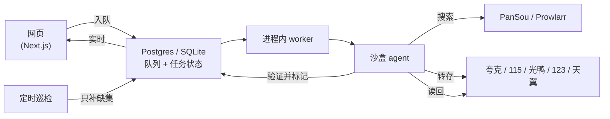

# 架构速览

网页端只负责入队；常驻的 worker 驱动一个沙盒里的 agent。agent 只有少量、会被记录的权限，所有真正改动网盘的动作都由确定的流程执行，做完再读回网盘上的真实状态来验证。

- 状态存在 **Postgres**（Docker）或 **SQLite**（桌面版），worker 重启后任务能接着跑：agent 按网盘和数据库里的真实状态重来，不靠缓存的对话记录。
- 影视信息来自 **TMDB**（内置代理兜底，开箱即用）；资源搜索用 **PanSou**，可选再接 **Prowlarr**（磁力 / 种子索引器）。

更细的模块拆解见 [架构深度分析](architecture-deep-dive.md)（2026-06 的快照，部分细节已变）。
